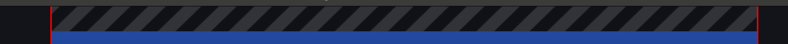

# obs-studio 美颜+无绿幕抠图+贴纸
基于最新 obs-studio 30.2.2开发的美颜抠图滤镜，可以实现无绿幕直接抠图。 

## 安装使用流程如下 
### 1、先根据自己的系统选择文件下载 
苹果M芯片下载地址：[https://down.koudaiqiche.com/obs-beauty-1.1-apple.dmg](https://down.koudaiqiche.com/obs-beauty-1.1-apple.dmg) 
windows下载地址：[https://down.koudaiqiche.com/obs-beauty-win-1.0-x64.exe](https://down.koudaiqiche.com/obs-beauty-win-1.0-x64.exe) 
【windows第一次安装需要安装 [https://aka.ms/vs/17/release/vc_redist.x64.exe](https://aka.ms/vs/17/release/vc_redist.x64.exe) 】 
目前只支持苹果M芯片和windows64位系统，安装好后请先微信扫码登录 
### 2、安装文件 
如果win装了360会提醒，需全部点允许 
### 3、启动程序，mac启动obs,win启动桌面的obs-beauty 
### 4、第一次会出现二维码扫码框，拿出手机微信扫码 
### 5、扫码关注公账号后，程序会自动启动。扫码一次后下次使用就不需要了 
### 6、进入后点右下角设置 
mac启动后会去获取屏幕录制、麦克风、摄像头和辅助功能都需要点允许。如果没有获取到权限可以点击菜单obs studio > 检查应用权限。 
 
 
无障碍环境如果获取不了权限，可以先把列表里的obs选中再点下面的－移除，然后再点+重新添加obs就可以了
 
点设置操作 
 
点左边的输出，录像格式这里选择 分片MP4 
 
视频这里 基础和输出都选 **1920x1080** 🌟🌟 很重要一定要设置🌟🌟 
 
### 7、添加场景来源 
 
添加视频采集设备 
 
选择对应的摄像头 

### 8、添加滤镜 
点中视频采集设备再点击滤镜 
 
在音视频滤镜  **美颜+抠图** 滤镜 
 
**设置如下图** 
 
并勾选 **开启背景处理**，可以调整美颜设置 
还需要在效果滤镜里添加 **色度键**  这样背景就透明了（最好在灯光比较亮的环境操作，背景环境不要太深，最好是全白之类的） 
  
**最终效果如下图** 
 
### 9、先打开ppt选择幻灯片播放，然后切换到obs(win是ALT+TAB快捷键，mac是command+tab快捷键)再继续在场景来源里添加屏幕采集，方式选择窗口采集，勾选名称为空和显示全屏，然后在窗口中选择对应的 幻灯片放映 
 
 
然后在工作区调整视频区域位置，在工作区选中屏幕采集，调整好宽度到100%，再把屏幕拖上点的位置，ppt上部恰好沿着边缘；一定要注意第6步的视频设置都需要设置1920x1080 
 
在场景来源里选中屏幕采集，点击下面的向下按钮把屏幕采集放下面，视频采集就放到上层了。 
 
然后再调整视频稍微靠右，视频需要全身像的就需要拉满高度，不需要就放到右下角。都测试好后可以在来源哪里点击锁定，避免挪动了位置。 
### 10、全部设置好后就可以开始录制，然后ptt 幻灯片播放，录制完成后再停止录制，点菜单里的文件显示录像就可以看到刚才录制的视频文件，然后使用剪映等工具进行剪辑。(如果window系统装了360安全卫士会提醒，都点允许就好) 
 
如果不需要摄像头直接点击这个眼睛隐藏，位置调整好后可以点击锁定锁定位置。 
 
停止录制 
 
显示录像可以打开录像视频存储文件夹，可以看到所有录制视频列表 

 
还可以去 设置 > 快捷键 里设置开始录制和停止录制的快捷键，这样就可以直接快捷键操作了！ 
 

